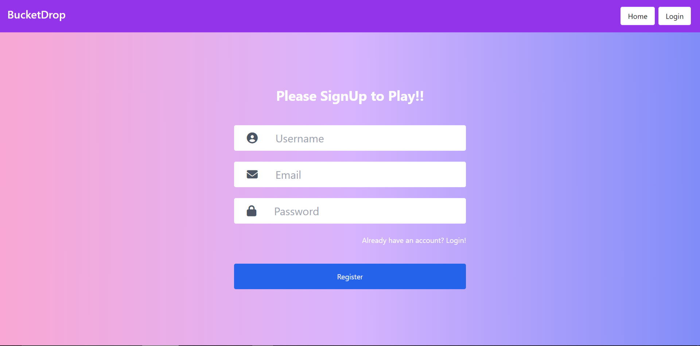
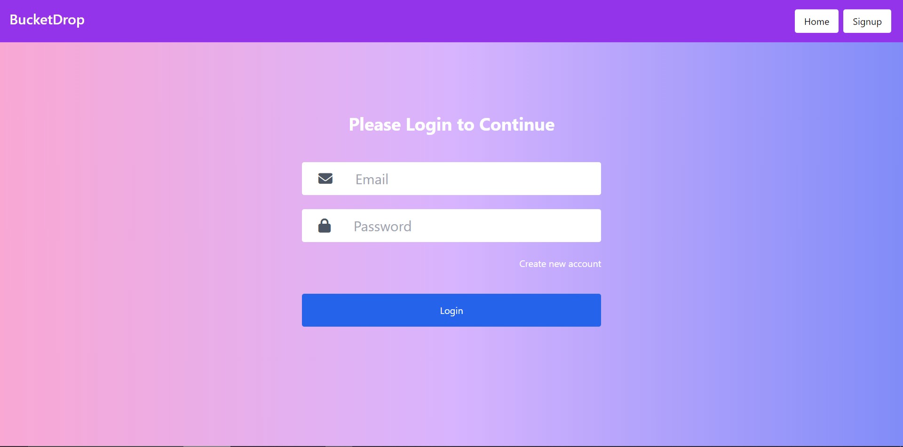
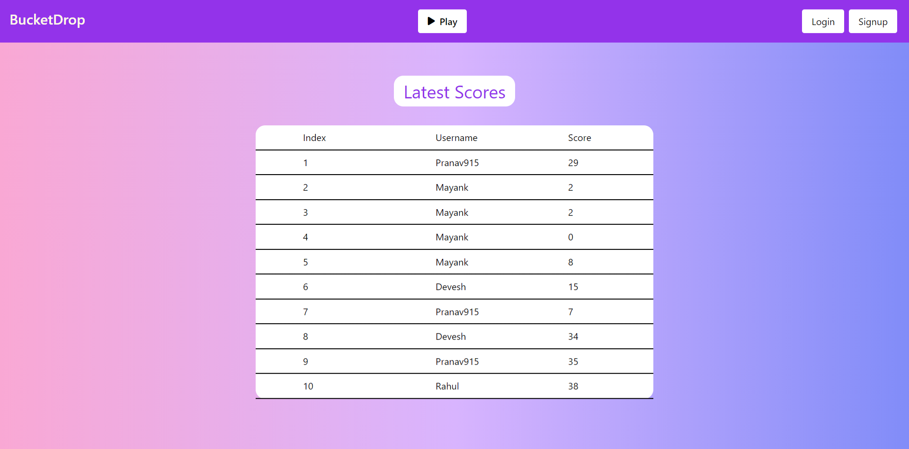
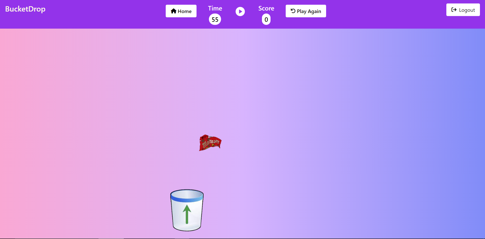

# BucketDrop - Drag & Drop Game

- Website Link - https://bucket-drop.herokuapp.com

## Installation

- First download the project from github.
- Open the terminal in the folder BucketDrop and run the following command to install all the dependencies .

```bash
npm install
```

- Now run the same command by doing cd in the client folder to install the remaining dependencies in react app.

## Usage

- After installing all the packages, run this command in BucketDrop & client folder

```bash
npm start
```

## Description :

- BucketDrop is a drag & drop game built on MERN Stack.
- Secure Authentication
- Live Score & Time Counter
- Shows Last 10 games played on server

## Tech Stack :

- HTML
- CSS
- React.js
- Redux
- Node.js
- Express.js
- Mongoose
- MongoDB
- JSON Web Token
- Tailwind

## **Images** :

### Sign Up

- Entering a valid username, email & password will enable the register button



### Login



### Home

- Shows last 10 games played on the server
- Click on play to start playing the game



### Game Page

- Time & Score are updated live on the app bar
- Click play to start playing
- Drag & Drop the garbage in the bucket to increase your score.


